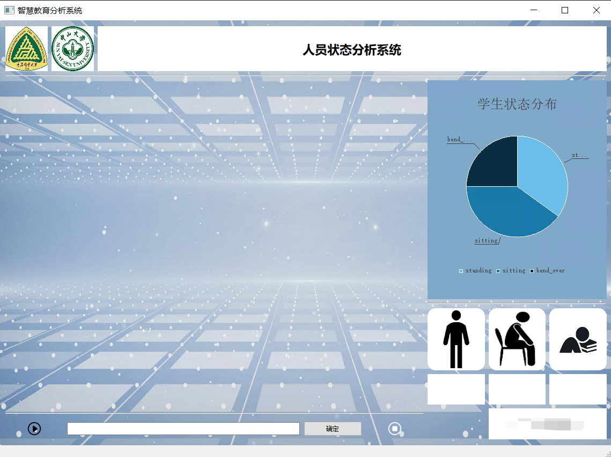
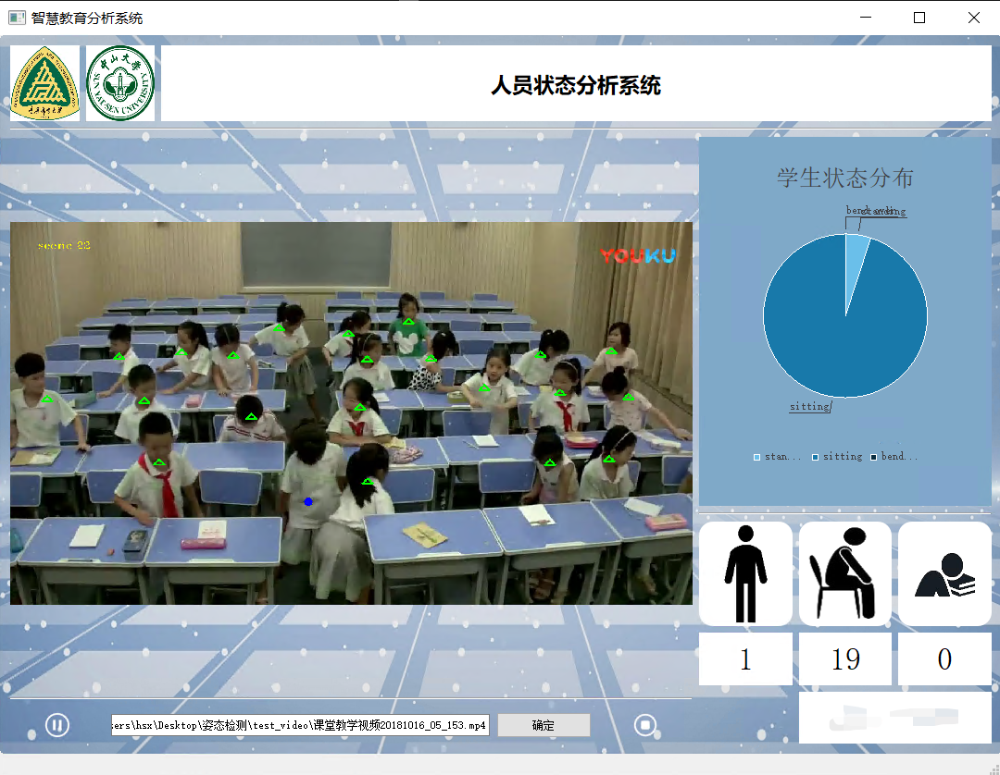

# 学生状态检测Demo

## 项目简介
本界面用于重点研发项目的成果展示，可以接入不同模型，实时展示检测结果。
这是一个c++实现的Qt界面，采用多线程实现，主线程中运行界面程序，子线程中捕获摄像头视频流或者打开本地视频，对视频帧处理后送入我们训练的教育场景状态检测模型，得到人物框和状态判别。
子线程发送检测结果（包含绘制了框的视频帧和检测结果信息）给主线程，刷新界面。

## 界面展示

- 包含检测视频输出，统计信息展示

